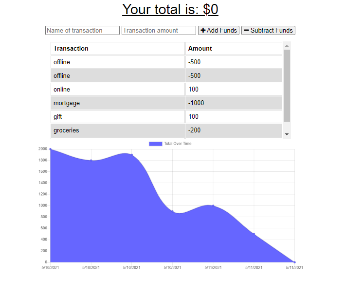

# Budget-Tracker

## Deployed Link

https://budget-tracker4290.herokuapp.com/

## Description

An application to help the user better plan their finances. Each transaction can be added or subtracted depending on if the transaction is a debit or credit. Once the transaction is submitted it will be added to a graph where the user can have a visual of their activity over the past 7 transactions. 

This is a progressive web application. Instead of accessing the application through the browser, the user can download the app from the web browser to their desktop or phone. 

If you loose your network do not worry. This application will still store any transaction even if they are not connect to a network. The information submitted will be added to the database once they are connect to a network again.

## Installation

Visit the deployed link and click the download icon in web browser. The application will be download to your desktop or device. 

## Usage

Once the application is open the user can submit a transaction.

## License

Copyright © 2021 Keith Black

Permission is hereby granted, free of charge, to any person obtaining a copy of this software and associated documentation files (the "Software"), to deal in the Software without restriction, including without limitation the rights to use, copy, modify, merge, publish, distribute, sublicense, and/or sell copies of the Software, and to permit persons to whom the Software is furnished to do so, subject to the following conditions:

The above copyright notice and this permission notice shall be included in all copies or substantial portions of the Software.

THE SOFTWARE IS PROVIDED "AS IS", WITHOUT WARRANTY OF ANY KIND, EXPRESS OR IMPLIED, INCLUDING BUT NOT LIMITED TO THE WARRANTIES OF MERCHANTABILITY, FITNESS FOR A PARTICULAR PURPOSE AND NONINFRINGEMENT. IN NO EVENT SHALL THE AUTHORS OR COPYRIGHT HOLDERS BE LIABLE FOR ANY CLAIM, DAMAGES OR OTHER LIABILITY, WHETHER IN AN ACTION OF CONTRACT, TORT OR OTHERWISE, ARISING FROM, OUT OF OR IN CONNECTION WITH THE SOFTWARE OR THE USE OR OTHER DEALINGS IN THE SOFTWARE.

## Contact Info

For any questions feel free to reach out Keith Black at KeithBlack4290@gmail.com

